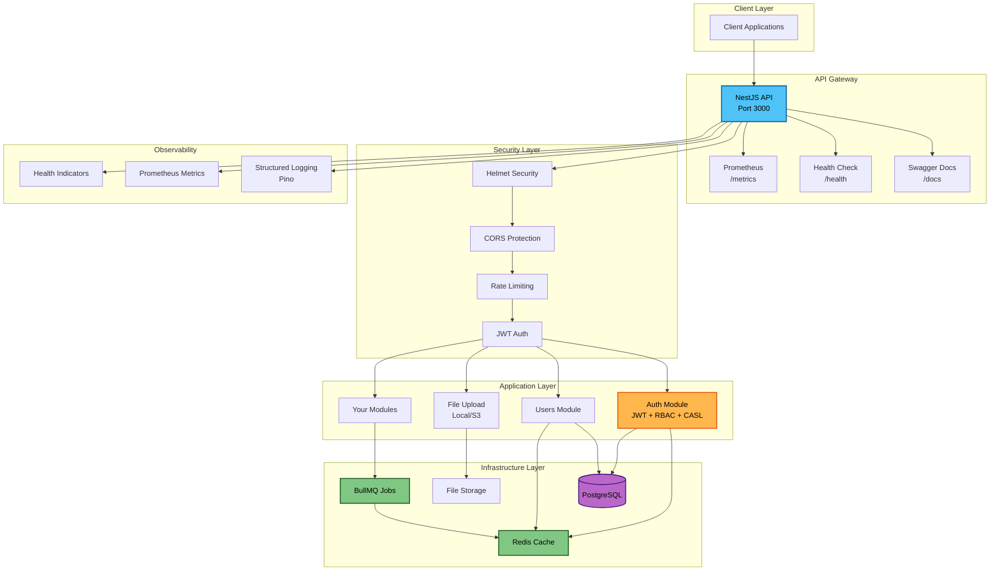
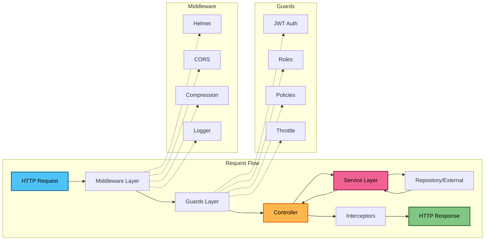
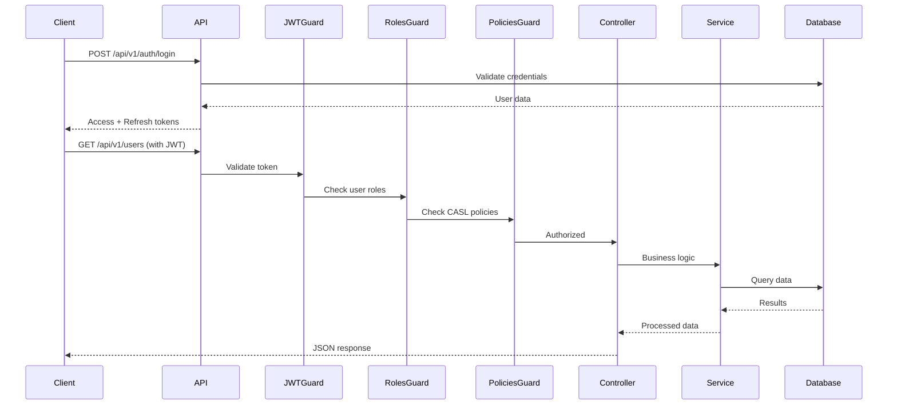
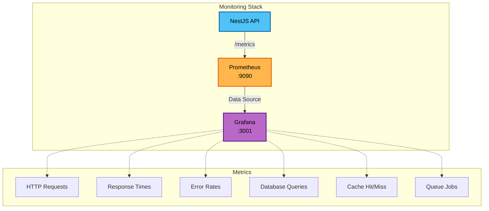

# Enterprise-Grade NestJS Boilerplate

A production-ready, enterprise-grade boilerplate for building robust and scalable backend applications with NestJS. This "batteries-included" foundation follows industry best practices for security, observability, and performance.



## ✨ Features

### 🏗️ Core Architecture
- **Modular Design**: Domain-driven structure with clear separation of concerns
- **Type Safety**: Full TypeScript support with strict type checking
- **Configuration**: Type-safe environment validation using Zod schemas
- **Request Context**: Request-scoped context management with `nestjs-cls`
- **API Versioning**: Global URI-based versioning strategy

### 🗄️ Database & Persistence
- **TypeORM Integration**: Powerful ORM with PostgreSQL support
- **Automated Migrations**: Version-controlled database schema changes
- **Database Seeding**: Automated initial data population
- **Soft Deletes**: Non-destructive record deletion
- **Audit Logging**: Automatic tracking of `createdBy`, `updatedBy`, `createdAt`, `updatedAt`
- **Query Builder**: Advanced filtering, sorting, and pagination utilities

### 🔐 Security
- **Helmet**: Security headers protection
- **CORS**: Configurable cross-origin resource sharing
- **Rate Limiting**: Redis-backed request throttling with multiple tiers
- **Input Validation**: Global validation pipes with `class-validator`
- **JWT Authentication**: Secure token-based auth with refresh token strategy
- **RBAC**: Role-Based Access Control for coarse-grained permissions
- **CASL Policies**: Fine-grained, policy-based authorization
- **Password Hashing**: Secure bcrypt password encryption

### ⚡ Performance
- **Redis Caching**: Intelligent caching layer to reduce database load
- **Response Compression**: Gzip compression for reduced bandwidth
- **Connection Pooling**: Optimized database connection management
- **Background Jobs**: Async task processing with BullMQ
- **Circuit Breaker**: Resilience pattern using Opossum (industry standard)

### 📊 Observability
- **Structured Logging**: JSON logs with `nestjs-pino` for easy parsing
- **Health Checks**: Comprehensive `/health` endpoint with dependency monitoring
- **Prometheus Metrics**: Custom metrics endpoint for monitoring and alerting
- **Request Tracing**: Unique request IDs for distributed tracing
- **Swagger Documentation**: Auto-generated API docs (development only)

### 🔄 Async Operations
- **BullMQ**: Robust job queue for background processing
- **Cron Jobs**: Scheduled tasks with `@nestjs/schedule`
- **Event Emitter**: Decoupled event-driven architecture
- **Circuit Breaker**: Automatic failure detection with Opossum

### 🛠️ Developer Experience
- **File Uploads**: Flexible upload handling (local filesystem or S3)
- **Internationalization**: Multi-language support with `nestjs-i18n`
- **Hot Reload**: Fast development with watch mode
- **Testing**: Jest setup for unit and E2E tests
- **Code Quality**: ESLint + Prettier for consistent code style
- **Docker Support**: Multi-stage Dockerfile and docker-compose setup

## 🚀 Quick Start

### Prerequisites

- [Docker](https://www.docker.com/get-started) and [Docker Compose](https://docs.docker.com/compose/install/)
- Node.js 18+ (for local development)
- PostgreSQL 14+ (if running without Docker)
- Redis 7+ (if running without Docker)

### Running with Docker (Recommended)

1. **Clone the repository:**
   ```bash
   git clone <repository-url>
   cd <repository-name>
   ```

2. **Create environment file:**
   ```bash
   cp .example.env .env
   ```

3. **Start all services:**
   ```bash
   docker-compose up --build
   ```

4. **Access the application:**
   - API: http://localhost:3000/api/v1
   - Swagger Docs: http://localhost:3000/docs
   - Health Check: http://localhost:3000/api/v1/health
   - Metrics: http://localhost:3000/api/v1/metrics

### Running Locally

1. **Install dependencies:**
   ```bash
   npm install
   ```

2. **Set up environment variables:**
   ```bash
   cp .example.env .env
   # Edit .env with your local database and Redis credentials
   ```

3. **Start PostgreSQL and Redis:**
   ```bash
   docker-compose up -d postgres redis
   ```

4. **Run migrations:**
   ```bash
   npm run migration:run
   ```

5. **Seed the database:**
   ```bash
   npm run seed
   ```

6. **Start the development server:**
   ```bash
   npm run start:dev
   ```

### ⚠️ Security Note

The `docker-compose.yml` file contains default credentials for development. **Always change these in production environments.**

## 📁 Project Structure

```
src/
├── config/                 # Configuration files
│   ├── env.schema.ts       # Zod environment validation
│   └── typeorm.config.ts   # TypeORM configuration
├── core/                   # Core/shared components
│   ├── entity/             # Base entities with audit fields
│   ├── interceptors/       # Global interceptors (metrics, request-id)
│   └── subscribers/        # TypeORM subscribers (audit logging)
├── common/                 # Common utilities
│   ├── decorators/         # Custom decorators
│   ├── dto/                # Shared DTOs (pagination, query)
│   ├── enums/              # Shared enums
│   ├── filters/            # Exception filters
│   ├── interfaces/         # Shared interfaces
│   └── services/           # Shared services (query builder)
├── database/
│   └── migrations/         # TypeORM migrations
├── i18n/                   # Internationalization files
├── modules/                # Feature modules
│   ├── auth/               # Authentication & authorization
│   │   ├── casl/           # CASL ability factory
│   │   ├── decorators/     # Auth decorators
│   │   ├── guards/         # Auth guards
│   │   └── strategies/     # Passport strategies
│   ├── cache/              # Redis caching
│   ├── file-upload/        # File upload handling
│   ├── health/             # Health checks
│   ├── prometheus/         # Metrics
│   ├── seeding/            # Database seeding
│   └── users/              # User management
├── app.module.ts           # Root module
├── main.ts                 # Application entry point
└── seed.ts                 # Seeding script

test/                       # E2E tests
docker-compose.yml          # Docker orchestration
Dockerfile                  # Multi-stage production build
```

## 🏛️ Architecture Overview



### Authentication & Authorization Flow



## 🔑 Key Concepts

### Module Structure
Each feature module follows a consistent pattern:
- **Module**: Dependency injection configuration
- **Controller**: HTTP route handlers
- **Service**: Business logic
- **Entity**: Database models
- **DTO**: Data validation and transformation
- **Guards**: Authorization logic

### Base Entity
All entities extend `BaseEntity` which provides:
```typescript
{
  id: UUID;              // Primary key
  createdAt: Date;       // Creation timestamp
  updatedAt: Date;       // Last update timestamp
  deletedAt?: Date;      // Soft delete timestamp
  createdBy?: string;    // User who created
  updatedBy?: string;    // User who last updated
}
```

### Query System
Built-in support for advanced querying:
```bash
# Pagination
GET /api/v1/users?page=1&limit=20

# Sorting
GET /api/v1/users?sortBy=createdAt&sortOrder=DESC

# Filtering
GET /api/v1/users?filters[role][eq]=admin
GET /api/v1/users?filters[email][like]=@company.com
GET /api/v1/users?filters[createdAt][gte]=2024-01-01

# Combined
GET /api/v1/users?page=2&limit=50&sortBy=username&filters[role][in]=admin,moderator
```

### Authorization Layers
1. **JWT Guard**: Validates authentication token
2. **Roles Guard**: Checks user roles (RBAC)
3. **Policies Guard**: Enforces CASL policies (fine-grained)
4. **Ownership Guard**: Validates resource ownership

## 📖 Documentation

- **[User Guide](GUIDE.md)**: Detailed feature documentation and examples
- **API Documentation**: Available at `/docs` when running in development mode
- **Health Check**: Monitor service health at `/api/v1/health`
- **Metrics**: Prometheus metrics at `/api/v1/metrics`


## 🧪 Testing

```bash
# Unit tests
npm test

# Watch mode
npm run test:watch

# Coverage report
npm run test:cov

# E2E tests
npm run test:e2e
```

## 🔧 Common Tasks

### Adding a New Module

1. Generate module structure:
   ```bash
   nest g module modules/posts
   nest g controller modules/posts
   nest g service modules/posts
   ```

2. Create entity in `modules/posts/entities/post.entity.ts`
3. Create DTOs in `modules/posts/dto/`
4. Add authorization guards to controller
5. Generate and run migration

### Creating a Database Migration

```bash
# Generate migration from entity changes
npm run migration:generate -- src/database/migrations/AddPostsTable

# Run pending migrations
npm run migration:run
```

### Adding a Background Job

```typescript
// Define processor
@Processor('email-queue')
export class EmailProcessor extends WorkerHost {
  async process(job: Job) {
    // Process job
  }
}

// Queue job
await this.emailQueue.add('send-welcome', { userId });
```

### Implementing CASL Policies

```typescript
// In casl-ability.factory.ts
can(Action.UPDATE, Post, { authorId: user.id });
can(Action.DELETE, Post, { authorId: user.id });

// In controller
@CheckPolicies((ability) => ability.can(Action.UPDATE, Post))
async update(@Param('id') id: string) { }
```

## 🐳 Docker Commands

```bash
# Start all services
docker-compose up -d

# View logs
docker-compose logs -f api

# Rebuild after changes
docker-compose up --build

# Stop all services
docker-compose down

# Remove volumes (clean slate)
docker-compose down -v
```

## 📊 Monitoring & Observability

### Grafana Dashboard

The boilerplate includes a pre-configured Grafana dashboard for monitoring:



Access Grafana at http://localhost:3001 (default credentials: admin/admin)

### Health Checks

The `/api/v1/health` endpoint monitors:
- Database connectivity
- Redis connectivity
- Memory usage
- Disk space

```json
{
  "status": "ok",
  "info": {
    "database": { "status": "up" },
    "redis": { "status": "up" }
  }
}
```

## 🚀 Deployment

### Production Build

```bash
# Build the application
npm run build

# Run production server
npm run start:prod
```

### Docker Production

```bash
# Build production image
docker build -t nestjs-api:latest .

# Run container
docker run -p 3000:3000 --env-file .env nestjs-api:latest
```

### Environment Variables

Key environment variables to configure:

```env
# Application
NODE_ENV=production
PORT=3000
API_PREFIX=api

# Database
DB_HOST=localhost
DB_PORT=5432
DB_USERNAME=postgres
DB_PASSWORD=your-secure-password
DB_DATABASE=nestjs_db

# Redis
REDIS_HOST=localhost
REDIS_PORT=6379

# JWT
JWT_SECRET=your-jwt-secret
JWT_EXPIRATION=15m
JWT_REFRESH_SECRET=your-refresh-secret
JWT_REFRESH_EXPIRATION=7d

# CORS
CORS_ORIGIN=https://yourdomain.com

# File Upload
UPLOAD_LOCATION=./uploads
AWS_S3_BUCKET=your-bucket
```

## 🤝 Contributing

1. Fork the repository
2. Create a feature branch (`git checkout -b feature/amazing-feature`)
3. Commit your changes (`git commit -m 'Add amazing feature'`)
4. Push to the branch (`git push origin feature/amazing-feature`)
5. Open a Pull Request

### Code Style

- Follow the existing code structure
- Use TypeScript strict mode
- Write unit tests for new features
- Run `npm run lint` before committing
- Use conventional commit messages

## 📝 License

This project is licensed under the UNLICENSED License.

## 🙏 Acknowledgments

Built with:
- [NestJS](https://nestjs.com/) - Progressive Node.js framework
- [TypeORM](https://typeorm.io/) - ORM for TypeScript
- [CASL](https://casl.js.org/) - Authorization library
- [BullMQ](https://docs.bullmq.io/) - Job queue
- [Pino](https://getpino.io/) - Logging library

## 📞 Support

- Documentation: [GUIDE.md](GUIDE.md)
- Issues: [GitHub Issues](https://github.com/your-repo/issues)
- Discussions: [GitHub Discussions](https://github.com/your-repo/discussions)

---

**Happy Coding! 🎉**
